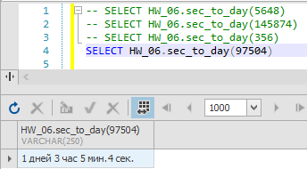

# Базы данных и SQL (семинары)

## SQL – Транзакции. Временные таблицы, управляющие конструкции, циклы

### Задание 1

Создайте функцию, которая принимает кол-во сек и форматирует их в кол-во дней, часов, минут и секунд.

Пример: **123456 ->'1 days 10 hours 17 minutes 36 seconds '**

```sql
DELIMITER $$

CREATE FUNCTION HW_06.sec_to_day(seconds int) 
  RETURNS varchar(250)
  DETERMINISTIC
BEGIN
  DECLARE result varchar(250);
  DECLARE days_value int DEFAULT 0;
  DECLARE hours_value int DEFAULT 0;
  DECLARE minutes_value int DEFAULT 0;

  -- считаем дни
  IF seconds >= 86400 THEN
    SET days_value = seconds DIV 86400;
    SET seconds = seconds % 86400;
  END IF;

  -- считаем часы
  IF seconds >= 3600 THEN
    SET hours_value = seconds DIV 3600;
    SET seconds = seconds % 3600; 
  END IF;

  -- считаем минуты / секунды
  IF seconds >=60 THEN
    SET minutes_value = seconds DIV 60;
    SET seconds = seconds % 60;
  END IF;
  
  SET result = CONCAT(
                    CAST(days_value AS CHAR), ' дней ',
                    CAST(hours_value AS CHAR), ' час ',
                    CAST(minutes_value AS CHAR), 'мин.');

  SET result = CONCAT(result, CAST(seconds AS CHAR), ' сек.');
  
  RETURN result;
END$$

DELIMITER ;
```

Вызов функции:





### Задание 2

Выведите только четные числа от 1 до 10 включительно. (Через функцию / процедуру)

Пример: **2,4,6,8,10** (*можно сделать через шаг +  2: х = 2, х+=2*)

Построим ХП с возвращаемым параметром.

```sql
DELIMITER $$ 

CREATE PROCEDURE even_numbers (IN count_number int, OUT result varchar(255))
BEGIN
  DECLARE i int DEFAULT 2;

  SET result = '';

  WHILE i < count_number DO
    SET result = CONCAT(result, CAST(i AS char), ' '); 
    SET i = i + 2;
  END WHILE;

END
$$

DELIMITER ;
```

Выполнение процедуры:


### Доп. задание

Cоздание процедуры, которая решает следующую задачу
Выбрать для одного пользователя 5 пользователей в случайной комбинации, которые удовлетворяют хотя бы одному критерию:
1) из одного города
2) состоят в одной группе
3) друзья друзей

```sql
DELIMITER $$

CREATE PROCEDURE find_person(IN find_id int)
BEGIN
  SELECT b.user_id, u.firstname, u.lastname
  FROM
    (SELECT user_id FROM
      (SELECT p.user_id
        FROM profiles p
        WHERE p.hometown = (SELECT hometown FROM profiles WHERE PROFILES.user_id = find_id)
      UNION
      SELECT id
        FROM communities
        WHERE id IN (SELECT community_id FROM users_communities WHERE user_id = find_id)) a
    UNION
    SELECT target_user_id 
      FROM friend_requests
      WHERE initiator_user_id IN (
        SELECT
           target_user_id
         FROM friend_requests
         WHERE initiator_user_id = find_id)) b
  LEFT JOIN users u
    ON b.user_id = u.id
  ORDER BY RAND()
  LIMIT 5;
END
$$

DELIMITER ;
```

Пример вызова:


Cоздание функции, вычисляющей коэффициент популярности пользователя

```sql
DELIMITER @@

CREATE FUNCTION celebrity(id int) 
RETURNS decimal 
BEGIN
  
  DECLARE result int DEFAULT 0;

  SELECT a.percent INTO result
    FROM
      (SELECT target_user_id, 100. * COUNT(target_user_id) / SUM(COUNT(*)) OVER () AS percent
      FROM friend_requests
      GROUP BY target_user_id) a
    WHERE a.target_user_id = id;
   
  RETURN result;

END
@@

DELIMITER ;
```

Пример выполнения функции:


